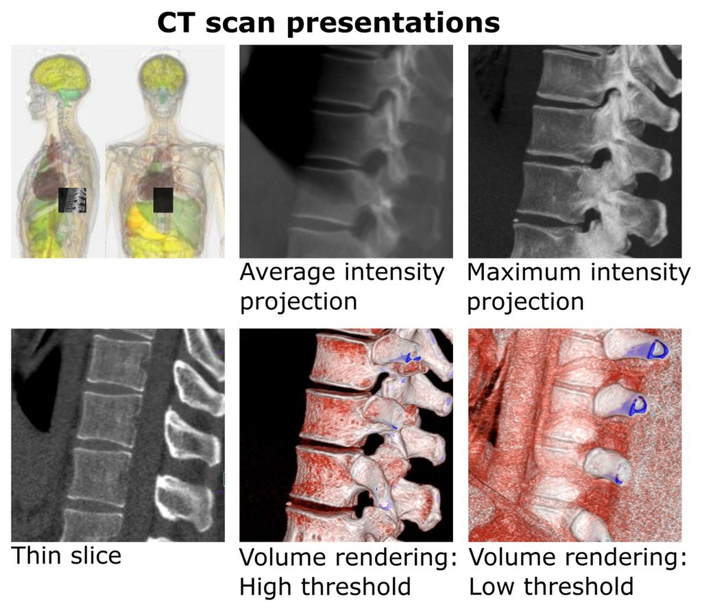

:::::::::::::::::::::::::::::::::::::: questions 

- What kinds of CTs are there?
- How can I create fusion images between CTs and other images?
- How can I visualize CT data?
- What is volume rendering?

::::::::::::::::::::::::::::::::::::::::::::::::

::::::::::::::::::::::::::::::::::::: objectives

- Show common kinds of CT imaging used in research
- Explain fusion images and demonstrate
- Explain the concept of windowing
- Explain different visualizations of CT data including MIP, MinIP and volume rendering


::::::::::::::::::::::::::::::::::::::::::::::::

## Introduction

There are various types of CTs and various ways to visualize them. 
Here we will briefly mention some emerging types of CTs so you can know what to expect in terms of the data and file types. Then we will explore algorithms for visualization. Someone without a background in radiology might assume that once a CT is converted out of a <>sinogram<> into a scrollable image, there is little left to be done. This depends upon your perspective. For human readers who want to do any kind of qualitative analysis, or even in some cases simply check the results of a machine learning algorithm, various visualization techniques can be of use. These include not only maximum intensity and minimum intensity projections but also volume rendering or even taking the CT out of the computer into 3D printing. In other cases we will want to visualize the CT and another modality at the same time. This is accomplished with fusion imaging. The basics of some visualizations will be covered in this episode as visualization is a worthy research topic in and of itself. 


### Different types of CT data

From the perspective of computation there is not always a significant difference in all CTs even if they have different acquisition protocols. For example a high resolution CT (HRCT) may look prettier, and have had a different scanning protocol,  but in the end we are still speaking about a 3D array of voxels. There are however a few kinds of CT where the shape of the data will be different. 

The most prominent case of this is perfusion CT where the data is taken to show blood flow.  TRATRA
HERE WE WILL PUT IN AN EXPLANATION ABOUT THESE FILES

Another newer technology with a different sort of data is 4D CT. 4D CT is multiple 3D CTs acquired over various time points. Clinically this type is not standard, but it is an area of active research for various problems such as assesing joint motion or precise calculation of the behaviours of contrast materials given to patients. 4D CTs will usually be put inside a DICOM, but the possible file formats vary. In the easy and thankfully not uncommon case scenario the image is simply a set of 3D images with metadata in the DICOM that give each image a time tag. In this case you can use all the tools you are familiar with, and often SITK will provide well implemented algorithms for basic processing. However, in some cases 4DCT data can be in videos or other file types.

### Visualizations

Most clinicans will see CTs by scrolling through them on a PACS system. Such software will have tools to provide certain projections i.e. maximium intensity projection and minimum intensity projection and even volume rendering automatically.
Let's look at an image where some different projections are rendered. 

{alt='CT visualization images.'}

*sourced from Mikael Häggström & Anatomography, CC BY-SA 2.1 JP <https://creativecommons.org/licenses/by-sa/2.1/jp/deed.en>, via Wikimedia Commons*
As you can imagine each type of visualization leds itself to awnsering different questions. 


```python

python
import numpy as np
import matplotlib.pyplot as plt
from skimage import io, color, img_as_float

# Load two images (assuming grayscale, convert to grayscale if necessary)
image1 = io.imread('image1.jpg')  # Replace with your image path
image2 = io.imread('image2.jpg')  # Replace with your image path

# Convert to grayscale if they are in color
if len(image1.shape) == 3:
    image1 = color.rgb2gray(image1)

if len(image2.shape) == 3:
    image2 = color.rgb2gray(image2)

# Convert images to float (skimage handles images as floats between 0 and 1)
image1 = img_as_float(image1)
image2 = img_as_float(image2)

# Normalize both images to the same shape (smallest common size)
min_shape = (min(image1.shape[0], image2.shape[0]), min(image1.shape[1], image2.shape[1]))
image1_resized = image1[:min_shape[0], :min_shape[1]]
image2_resized = image2[:min_shape[0], :min_shape[1]]

# Perform fusion by averaging the pixel values
fused_image = (image1_resized + image2_resized) / 2

# Display the results
fig, axes = plt.subplots(1, 3, figsize=(12, 4))
ax = axes.ravel()

ax[0].imshow(image1_resized, cmap='gray')
ax[0].set_title("Image 1")
ax[1].imshow(image2_resized, cmap='gray')
ax[1].set_title("Image 2")
ax[2].imshow(fused_image, cmap='gray')
ax[2].set_title("Fused Image")

for a in ax:
    a.axis('off')

plt.tight_layout()
plt.show()

# Save the fused image if needed
io.imsave('fused_image.jpg', fused_image)
```

