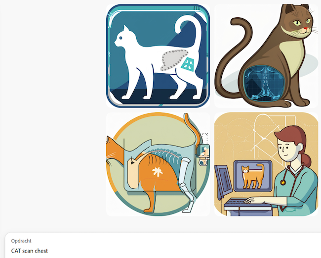

:::::::::::::::::::::::::::::::::::::: questions 

- What is generative AI?
- How can I safely use generative AI in my work?

::::::::::::::::::::::::::::::::::::::::::::::::

::::::::::::::::::::::::::::::::::::: objectives

- Show examples of generative AI
- Discuss some potential dangers and pitfalls of generative AI

::::::::::::::::::::::::::::::::::::::::::::::::

## Introduction

Generative AI is AI that creates or generates data. Since the early 2020s, there has been a lot of news about large language models, especially chatbots such as ChatGPT, Copilot, and LLaMA. There are also many programs which can create images such as Stable Diffusion, Midjourney and DALL-E. Some such programs can be used not only to generate images, but to transfer styles.

The potential uses of such technologies are quite broad in the field of medical imaging. Potentially such tools can even be used in the interpretation of medical images as well as a plethora of other tasks. Obviously participants in this course may be particularly interested in the facts that large language models (LLMs) can be used to generate code, and some models may be able to generate vast quantities of synthetic image or text data. Research is ongoing. There is also an ongoing debate about the safety of such models. What is certain is that depending upon the software or model you use, data given into the system may become the property of the software owners. Think twice before entering any patient data into such a system. Try to understand what might happen to the data. Does it stay on your server or go into the cloud somewhere (which may be then sent to data storage for the company that made the software)? 

:::::::::::::::::::::::::::::::::::::::::::::::::::::::::::::::::::: instructor

Inline instructor notes: if Zenodo is unavailable ...

::::::::::::::::::::::::::::::::::::::::::::::::::::::::::::::::::::::::::::::::

## Using generative AI tools well

### Using generative AI safely

- Never upload non-anonymized sensitive patient data away from your own servers
- Never use sensitive patient data as input into online tools (e.g. chatGPT, potentially integrated tools like co-pilot, MSOffice) 
- Remember your code editor, or other products may be connected to the internet 
- Try to use systems that can be run locally (on your own machine or hospital servers)
- Remember that tools could generate incorrect information (hallucinations)
- Do not assume code generated by an LLM does not contain potentially harmful code e.g. with bugs
- Check the intellectual property and all ethical issues around how you are using a gen AI model
- Document your use of models in academic work (include versions and exact use)
- Be aware that the corpus such models are trained on may introduce biases

Stable Diffusion is an open source tool that can be run locally which many have used succesfully for image generation. Older versions probably needs some GPUs to run on. Internet rumor has it that there are now builds of this tool that can be run on a CPU, very slowly. If you need to generate a large number of images with any tool, save time and make sure you can run on a GPU.
One downside to this tool, and many others like it, is that the model is not trained or changed by you, you can't put in your own dataset.

:::::::::::::::::::::::::::::::::::::::  challenge

## What is safe

Can you think of a few risks of a model run completely on your machine?

:::::::::::::::  solution

## Solution

One risk of any model is that it could contain malicious code. Any model run entirely locally will need to be downloaded to your machine. There is no garuntee that such a model will not contain malware. We therefore encourage the use of open souce models.

Another risk of some models is that the content generated will not be worth the environmental costs. The creation and maintenence of such models uses an astounding amount of resources including carbon and water. We do not suggest running models like ChatGPT endlessly. Even when you run a model locally, this is still in some sense a risk. 

Yet another risk is that you may unwittingly inject your data and algorithms with all kinds of biases. While humans can not interpret patient ethnicity from body imaging, increasing research proves certain AI algorithms not only can, but may use correlations of this data. 

:::::::::::::::::::::::::

::::::::::::::::::::::::::::::::::::::::::::::::::

### Using generative programs effectively

The content generated by generative tools will differ based on exactly the words or images entered. The shaping of the words input is often called prompt engineering. 

A typical approach towards making content to balance a dataset for machine learning might include first understanding the dataset balance by important labels, then describing images with such labels and only then build prompts based on tthe description of label categories with fewer images. Such an approach limits the use of the model, which has risks and impact, towards useful outcomes.

Remember that content generation may be in some senses a nearly stochastic process. Therefore you may need to change prompts, and even sequences of prompts. 

:::::::::::::::: callout

### tips on prompting for outputs:

0. Make sure to use correct spelling and grammar (otherwise you may send the tool in a wrong direction)
1. Try to be very specific in your prompt
2. State your intent (helping my son ... can you explain it in a specific way?)
3. Experiment with different phrasing
4. Do effective fact checking on text: first pass the result back and ask it to fact-check, then use a search engine and/or expert to start to verify; never trust a reference (or any fact) generated by an LLM, look for human generated content
5. If you want a format e.g. bullet points of text, or a square image , then specify the format
6. Consider asking LLMs to be a role e.g. 'ýou are a python expert' or 'you are an expert pathologist' as part of prompt
7. If you are using a foundation model, consider fine-tuning it

::::::::::::::

Attention to detail when prompting is critical. The following was generated with a popular tool by misspelling X-ray.

{alt='Misled image'}

*Image generated by Dr. Candace Makeda Moore prompting Adobe Firely*

While the above result is laughable, more subtle mistakes may be hard to spot for someone who is not a medical specialist with years of training. A medical specialist may be required to check that your generated data is actually valid. 

Remember the corpus for some of the algorithms is some stuff scraped off the internet. Lots of cute cat pictures, and very few good examples of desmoplastic infantile ganglioma. CTs used to be called CAT (computer axial tomography) images. But 'CAT scan' as a prompt will not produce an image of an old CT.

{alt='Misled image of cats'}

*Image generated by Dr. Candace Makeda Moore prompting Adobe Firely*

:::::::::::::::::::::::::::::::::::::::: keypoints

- Generative programs can create synthetic data which may help improve many algorithms
- There are limitation to generative AI models
- Running a program locally on your own server is safer than a program which sends prompts to other servers
- Patient data should be entered into most programs with caution
- Many policies are in place to ensure safe and ethical use of such tools across institutions.

::::::::::::::::::::::::::::::::::::::::::::::::::
