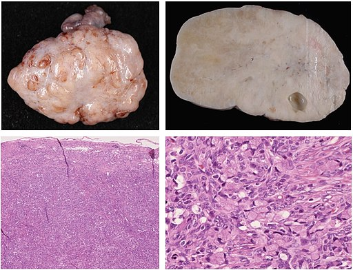
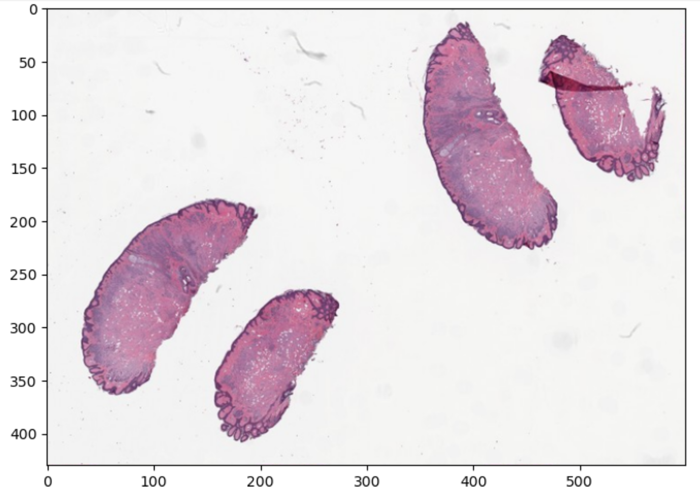
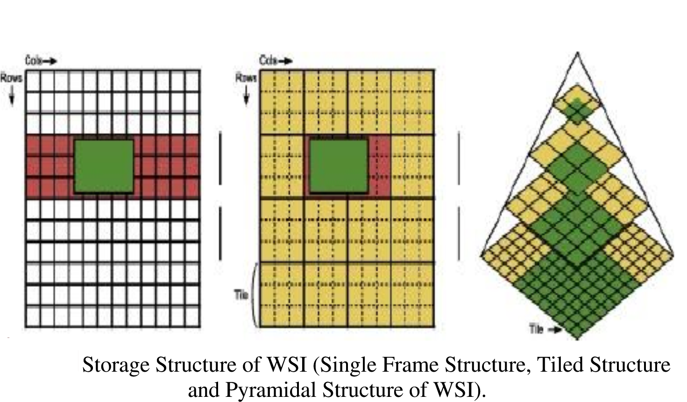
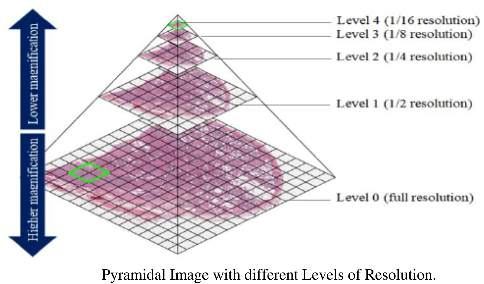

:::::::::::::::::::::::::::::::::::::: questions 

- What are some open libraries can be used with pathology?
- How are pathology slides different from a photo?
- What is the structure of a pathology slide?

::::::::::::::::::::::::::::::::::::::::::::::::

::::::::::::::::::::::::::::::::::::: objectives

- Describe some open source tools and libraries for pathology images
- Discuss  common file formats for pathology slides
- Explain tiling and pyramidal file formats
- Show basic code in openslide

::::::::::::::::::::::::::::::::::::::::::::::::

## Introduction

Pathologists deal with multiple types of images. Some pathologists may use photography when recording gross (or macroscopic) pathology data. The processing of digital photography is a straightforward application of general image processing. However the workhorse type image of pathology is the histopathological image, and this is very different from a photograph. 

In the below picture you can see an image with gross and histopathology of signet ring cell carcinoma metastasis to the ovary. The histopathology images are stained microscopy image. The gross pathology images are photographs.



*Nakamura, Yoshiaki; Hiramatsu, Ayako; Koyama, Takafumi; Oyama, Yu; Tanaka, Ayuko; Honma, Koichi, CC BY 3.0 <https://creativecommons.org/licenses/by/3.0>, via Wikimedia Commons*

In this lesson we will cover how to work with histopathology images as they differ from simpler multi-channel color image like a modern digital camera often produces. 

## File formats

In terms of histopathological images, you may find them in several file formats. Not every library or tool for such imaging works with every format. Below is a table with several file formats.


| Format Name |Extension|Notes|  More info|
| ----------- |---------|-----|-----------|
| TIFF     |.tiff|tag image file format| can be tiled |https://www.loc.gov/preservation/digital/formats/fdd/fdd000022.shtml|
| OME-TIFF       |.ome.tiff, ome.tif, .ome.tf2, .ome.tf8 or .ome.btf | includes XML and may be multiple TIFFs|https://brainder.org/2012/09/23/the-nifti-file-format/|
| SVS         | .svs    | Scanned Virtual Slide  |https://www.dicomstandard.org/  |
| DICOM       |.dcm or none|supports an included WSI file|https://dicom.nema.org/dicom/dicomwsi/|


 The table above is far from complete because any vendors have their own file format, however the community is consolidating towards shared file formats that are not vendor specific. The table is organized in a manner of ascending complexity. A simple general TIFF file is very close to a simple raster image. Such a file for a high resolution image would be quite large and potentially hard to manage based on size alone. Tiling in a way to more efficiently manage huge images. 

 Tiling  approaches will be very familiar to anyone who comes from the world of GIS, mapping or digital geography. Maps provide a really obvious way to think about the advantages of pyramidal tiling. Imagine if every time you wanted to get a map with directions, and check out a picture of your destination, you needed to load a detailed map picture of the entire world, literally. It would be incredibly inefficient and taxing on your computer or smartphone. It's much more efficient to just load what you need. There are many ways this can be done but practically some variation of pyramidal tiling is usually used. The same is true with tiled pathology images.
 
 
 Tiled images are made in a pyramidal structure, and at each level of the pyramid after zero there is a lower resolution downscaled version of the image. Each level of the pyramid has tiles, smaller parts of the image that are quilted into the whole image. Creating images in this way allows much more efficient access and management of images because you can load and display images at only one level. 
 An OME-TIFF file can be one or more tiled TIFFs and some XML in the header. An SVS file is essentially a tiled TIFF image that has a few additional things like overview image. Various types of pathology files can be somehow packed into a DICOM which has it's own file specification. 

## Libraries

There is actually very little in the way of open pure python libraries that deal with pathology images. 
A promising new contender is [TIA toolbox](https://tia-toolbox.readthedocs.io/en/latest/) ; however this is a relatively new library. 
There are better known (in the small community of researchers in digital pathology) more popular libraries that have binders or other tricks that allow you to process pathology images in Python. 
Probably the most popular is openslide, but other contenders include [Bio-Formats](http://www.openmicroscopy.org/bio-formats/) (which is both a libraru and a tool) and QuPath which has the distinct advantage of being able to work with OME-TIFF directly. 
One disadvantage of QuPath is that usually requires some Java knowledge. Bio-Formats has Python bindings but is also mainly a Java tool which can also be used as a C++ library, therefore we will use openslide as the vehicle to explore histopathology images in this lesson.

#### Reading TIFF histopathology Images

[Openslide](https://openslide.org/) is actually written in C, but you can also use Java or Python to work with is due to bindings.To run the code you will need to work in the `pathy` environment created with the environment_pathology.yml file.

```python
import openslide
from openslide import open_slide
import numpy as np
import matplotlib.pyplot as plt
```

After importing the needed libraries we can now load a slide, and print out it's properties.

```python
file_path = 'data/pathology/CMU-1.tiff'

slide_in = open_slide(file_path)

slide_in_props = slide_in.properties
print(slide_in_props)
```

```output
<_PropertyMap {'openslide.level-count': '9', 'openslide.level[0].downsample': '1', 'openslide.level[0].height': '32914', 'openslide.level[0].tile-height': '256', 'openslide.level[0].tile-width': '256', 'openslide.level[0].width': '46000', 'openslide.level[1].downsample': '2', 'openslide.level[1].height': '16457', 'openslide.level[1].tile-height': '256', 'openslide.level[1].tile-width': '256', 'openslide.level[1].width': '23000', 'openslide.level[2].downsample': '4.0001215362177929', 'openslide.level[2].height': '8228', 'openslide.level[2].tile-height': '256', 'openslide.level[2].tile-width': '256', 'openslide.level[2].width': '11500', 'openslide.level[3].downsample': '8.0002430724355857', 'openslide.level[3].height': '4114', 'openslide.level[3].tile-height': '256', 'openslide.level[3].tile-width': '256', 'openslide.level[3].width': '5750', 'openslide.level[4].downsample': '16.000486144871171', 'openslide.level[4].height': '2057', 'openslide.level[4].tile-height': '256', 'openslide.level[4].tile-width': '256', 'openslide.level[4].width': '2875', 'openslide.level[5].downsample': '32.014322017605849', 'openslide.level[5].height': '1028', 'openslide.level[5].tile-height': '256', 'openslide.level[5].tile-width': '256', 'openslide.level[5].width': '1437', 'openslide.level[6].downsample': '64.050935911470475', 'openslide.level[6].height': '514', 'openslide.level[6].tile-height': '256', 'openslide.level[6].tile-width': '256', 'openslide.level[6].width': '718', 'openslide.level[7].downsample': '128.10187182294095', 'openslide.level[7].height': '257', 'openslide.level[7].tile-height': '256', 'openslide.level[7].tile-width': '256', 'openslide.level[7].width': '359', 'openslide.level[8].downsample': '257.06193261173183', 'openslide.level[8].height': '128', 'openslide.level[8].tile-height': '256', 'openslide.level[8].tile-width': '256', 'openslide.level[8].width': '179', 'openslide.mpp-x': '1000', 'openslide.mpp-y': '1000', 'openslide.quickhash-1': '428aa6abf42c774234a463cb90e2cbf88423afc0217e46ec2e308f31e29f1a9f', 'openslide.vendor': 'generic-tiff', 'tiff.ResolutionUnit': 'centimeter', 'tiff.XResolution': '10', 'tiff.YResolution': '10'}>

```

When we printed the properties we can see we are dealing with a tiled slide because we have properties like levels and tile height and width. These may not be the only properties we care about. We most likely may care about mapping this image back to real world sizes. We have a property that tells us the microns per pixel. Let's look:

```python
print("Pixel size of X in um is:", slide_in_props['openslide.mpp-x'])
print("Pixel size of Y in um is:", slide_in_props['openslide.mpp-y'])
```

```output
Pixel size of X in um is: 1000
Pixel size of Y in um is: 1000
```

:::::::::::::::::::::::::::::::::::::::  challenge

## Challenge: Find the real world size of an image

There is a property of the loaded image which is (width, height) tuple for level 0 of the image. The property is called `dimensions`. Calculate the real world dimensions of our image in microns. 

Hint: Make sure you understand the type of each variable you assign. You can always check by printing out the type. 

:::::::::::::::  solution

## Solution

```python
# get the width and height
width, height = slide_in.dimensions

# get the spatial resolution in microns per pixel for the X and Y directions
microns_per_pixel_x = slide_in.properties.get(openslide.PROPERTY_NAME_MPP_X)
microns_per_pixel_y = slide_in.properties.get(openslide.PROPERTY_NAME_MPP_Y)

# convert to floats because they are strings
microns_per_pixel_x = float(microns_per_pixel_x)
microns_per_pixel_y = float(microns_per_pixel_y)

# calculate real-world dimensions of the slide in microns
real_world_width = width * microns_per_pixel_x
real_world_height = height * microns_per_pixel_y

# print the results
print(f"Real-world dimensions in microns: {real_world_width} microns (width), {real_world_height} microns (height)")
```

```output
Real-world dimensions in microns: 46000000.0 microns (width), 32914000.0 microns (height)
```

:::::::::::::::::::::::::

::::::::::::::::::::::::::::::::::::::::::::::::::


As you might guess loading this huge image is pointless if we just want a small image that gives us a general idea. We can use openslide to make a thumbnail.


```python
# get a thumbnail of the image and pop it out on your computer
slide_in_thumb_600 = slide_in.get_thumbnail(size=(600, 600))
slide_in_thumb_600.show() # 
```

With the above code an image will be opened on most operating systems, but if one does not open for you, do not depair.
We could also store off our thumbnail (or any part of the image for that matter)as a numpy array, and then graph it.

```python
# convert thumbnail to numpy array, and plot it
slide_in_thumb_600_np = np.array(slide_in_thumb_600)
plt.figure(figsize=(8,8))
plt.imshow(slide_in_thumb_600_np)  
```

```output
```


*The above image is part of the openslide sample images provided with the library, which is on an open software license*

We can also explore a bit about how the image is tiled.

```python

# get slide_in dims at each level of the pyramid at various levels
dims = slide_in.level_dimensions

num_levels = len(dims)
print("Number of levels in this image are:", num_levels)

print("Dimensions of various levels in this image are:", dims)

# understand by how much are levels downsampled from the original image
factors = slide_in.level_downsamples
print("Each level is downsampled by an amount of: ", factors)
```
```output
Number of levels in this image are: 9
Dimensions of various levels in this image are: ((46000, 32914), (23000, 16457), (11500, 8228), (5750, 4114), (2875, 2057), (1437, 1028), (718, 514), (359, 257), (179, 128))
Each level is downsampled by an amount of:  (1.0, 2.0, 4.000121536217793, 8.000243072435586, 16.00048614487117, 32.01432201760585, 64.05093591147048, 128.10187182294095, 257.06193261173183)
```
Pyramidal file structure and tiling are quite challenging to understand, and different file formats can actually implement the concepts a bit differently. Pyramids are actually a more general concept in image processing. The key concept about them to understand are that a pyramidal image simply represents the image at multiple scales, and that could be implemented in many different ways. Usually we don't create such pyramids by hand, but rather, you guessed it, algorithmically with code. 


*Images with modifications from article "KMIT-Pathology: Digital Pathology AI Platform for Cancer Biomarkers Identification on Whole Slide Images" with CC BY 4.0 license. Subramanian, Rajasekaran & Rajasekaran, Devikarubi & Tapadia, Rohit & Singh, Rochan. (2022). KMIT-Pathology: Digital Pathology AI Platform for Cancer Biomarkers Identification on Whole Slide Images. International Journal of Advanced Computer Science and Applications. 13. 10.14569/IJACSA.2022.0131170. *
