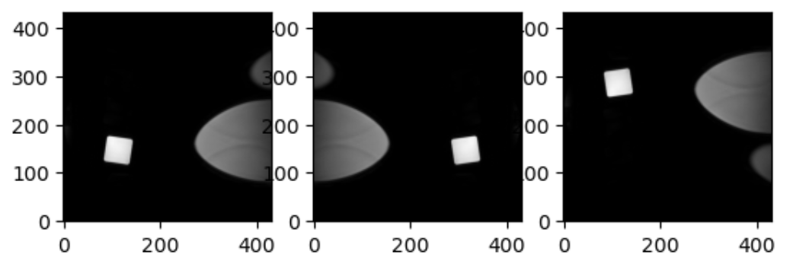

:::::::::::::::::::::::::::::::::::::: questions 

- What are some open libraries can be used with pathology?
- How are pathology slides different from a photo?
- What is the structure of a pathology slide?

::::::::::::::::::::::::::::::::::::::::::::::::

::::::::::::::::::::::::::::::::::::: objectives

- Describe some open source tools and libraries for pathology images
- Discuss  common file formats for pathology slides
- Explain tiling and pyramidal file formats
- Show basic code in openslide

::::::::::::::::::::::::::::::::::::::::::::::::

## Introduction

Pathologists deal with multiple types of images. Some pathologists may use photography when recording gross pathology data. The processing of digital photography is a straightforward application of general image processing. However the workhorse type image of pathology is the histopathological image, and this is very different from a photograph. In this lesson we will cover how such an image is set up and differs from a simple multi-channel color image like a modern digital camera often produces. 

## File formats

In terms of histopathological images, you may find them in several file formats. Not every library or tool for such imaging works with every format. Below is a table with several file formats.


| Format Name |Extension|Notes|  More info|
| ----------- |---------|-----|-----------|
| TIFF     |.tiff|tag image file format| can be tiled |https://www.loc.gov/preservation/digital/formats/fdd/fdd000022.shtml|
| OME-TIFF       |.ome.tiff, ome.tif, .ome.tf2, .ome.tf8 or .ome.btf | includes XML and may be multiple TIFFs|https://brainder.org/2012/09/23/the-nifti-file-format/|
| SVS         | .svs    | Scanned Virtual Slide  |https://www.dicomstandard.org/  |
| DICOM       |.dcm or none|supports an included WSI file|https://dicom.nema.org/dicom/dicomwsi/|


 The table above is far from complete because any vendors have thier own file format, however the community is consoludating towards shared file formats that are not vendor specific. The table is organized in a manner of ascending complexity. A simple general TIFF file is very close to a simple raster image. An OME-TIFF file can be one or more tiles TIFFs and some XML in the header. An SVS file is esssentially a tiled TIFF image that has a few additional things like overview image. Various types of pathology files can be somehow packed into a DICOM which has it's own file specification. 

## Libraries

There is actually very little in the way of open pure python libraries that deal with pathology images. There are however popular libraries that have binders or other tricks that allow you to process pathology images in Python. Probably the most popular is openslide.


:::::::::::::::: callout

### Popular open libraries for pathology:

- QuPath
- Openslide

::::::::::::::


#### Reading TIFF histopathology Images

[Openslide](https://nipy.org/nibabel/) is a...To run the code you will need to work in the `patho` environment created with

```python
import nibabel as nib
```

First, use the `load()` function to create a `NiBabel` image object from a NIfTI file.

```python
t2_img = nib.load("data/mri//OBJECT_phantom_T2W_TSE_Cor_14_1.nii")
```

When loading a NIfTI file with `NiBabel`, you get a specialized data object that includes all the information stored in the file. Each piece of information is referred to as an **attribute** in Python's terminology. To view all these attributes, simply type `t2_img.` followed by <kbd>Tab</kbd>.
We will focus on discussing mainly two attributes (`header` and `affine`) and one method (`get_fdata`). 

##### 1. Headers

 [The header](https://nipy.org/nibabel/nibabel_images.html#the-image-header) contains metadata about the image, including image dimensions, data type, and more.

```python
t2_hdr = t2_img.header
print(t2_hdr)
```

```output
<class 'nibabel.nifti1.Nifti1Header'> object, endian='<'
sizeof_hdr      : 348
data_type       : b''
db_name         : b''
extents         : 0
session_error   : 0
regular         : b''
dim_info        : 0
dim             : [  3 432 432  30   1   1   1   1]
intent_p1       : 0.0
intent_p2       : 0.0
intent_p3       : 0.0
intent_code     : none
datatype        : int16
bitpix          : 16
slice_start     : 0
pixdim          : [1.        0.9259259 0.9259259 5.7360578 0.        0.        0.
 0.       ]
vox_offset      : 0.0
scl_slope       : nan
scl_inter       : nan
slice_end       : 29
slice_code      : unknown
xyzt_units      : 2
cal_max         : 0.0
cal_min         : 0.0
slice_duration  : 0.0
toffset         : 0.0
glmax           : 0
glmin           : 0
descrip         : b'Philips Healthcare Ingenia 5.4.1 '
aux_file        : b''
qform_code      : scanner
sform_code      : unknown
quatern_b       : 0.008265011
quatern_c       : 0.7070585
quatern_d       : -0.7070585
qoffset_x       : 180.81993
qoffset_y       : 21.169691
qoffset_z       : 384.01007
srow_x          : [1. 0. 0. 0.]
srow_y          : [0. 1. 0. 0.]
srow_z          : [0. 0. 1. 0.]
intent_name     : b''
magic           : b'n+1'
```

`t2_hdr` is a Python **dictionary**, i.e. a container that hold pairs of objects - keys and values. Let's take a look at all of the keys.

Similar to `t2_img`, in which attributes can be accessed by typing `t2_img.` followed by <kbd>Tab</kbd>, you can do the same with `t2_hdr`.

In particular, we'll be using a **method** belonging to `t2_hdr` that will allow you to view the keys associated with it.

```python
print(t2_hdr.keys())
```

```output
['sizeof_hdr',
 'data_type',
 'db_name',
 'extents',
 'session_error',
 'regular',
 'dim_info',
 'dim',
 'intent_p1',
 'intent_p2',
 'intent_p3',
 'intent_code',
 'datatype',
 'bitpix',
 'slice_start',
 'pixdim',
 'vox_offset',
 'scl_slope',
 'scl_inter',
 'slice_end',
 'slice_code',
 'xyzt_units',
 'cal_max',
 'cal_min',
 'slice_duration',
 'toffset',
 'glmax',
 'glmin',
 'descrip',
 'aux_file',
 'qform_code',
 'sform_code',
 'quatern_b',
 'quatern_c',
 'quatern_d',
 'qoffset_x',
 'qoffset_y',
 'qoffset_z',
 'srow_x',
 'srow_y',
 'srow_z',
 'intent_name',
 'magic']
```

Notice that **methods** require you to include () at the end of them  when you call them whereas **attributes** do not.
The key difference between a method and an attribute is:

- Attributes are *variables* belonging to an object and containing information about their properties or characteristics
- Methods are functions that belong to an object and operate on its attributes. They differ from regular functions by implicitly receiving the object (`self`) as their first argument.

When you type in `t2_img.` followed by <kbd>Tab</kbd>, you may see that attributes are highlighted in orange and methods highlighted in blue. 

The output above is a list of **keys** you can use to access **values** of `t2_hdr`. We can access the value stored by a given key by typing:

```python
print(t2_hdr['<key_name>'])
```

:::::::::::::::::::::::::::::::::::::::  challenge

## Challenge: Extract Values from the NIfTI Header

Extract the 'pixdim' field from the NiFTI header of the loaded image.

:::::::::::::::  solution

## Solution

```python
print(t2_hdr['pixdim'])
```

```output
array([1. , 0.9259259, 0.9259259, 5.7360578, 0. , 0. , 0. , 0. ], dtype=float32)
```

:::::::::::::::::::::::::

::::::::::::::::::::::::::::::::::::::::::::::::::

##### 2. Data

As you've seen above, the header contains useful information that gives us information about the properties (metadata) associated with the MR data we've loaded in. Now we'll move in to loading the actual *image data itself*. We can achieve this by using the method called `t2_img.get_fdata()`:

```python
t2_data = t2_img.get_fdata()
print(t2_data)
```

```output
array([[[0., 0., 0., ..., 0., 0., 0.],
        [0., 0., 0., ..., 0., 0., 0.],
        [0., 0., 0., ..., 0., 0., 0.],
        ...,
        [0., 0., 0., ..., 0., 0., 0.],
        [0., 0., 0., ..., 0., 0., 0.],
        [0., 0., 0., ..., 0., 0., 0.]],

       [[0., 0., 0., ..., 0., 0., 0.],
        [0., 0., 0., ..., 0., 0., 0.],
        [0., 0., 0., ..., 0., 0., 0.],
        ...,
        [0., 0., 0., ..., 0., 0., 0.],
        [0., 0., 0., ..., 0., 0., 0.],
        [0., 0., 0., ..., 0., 0., 0.]],

       ...,

       [[0., 0., 0., ..., 0., 0., 0.],
        [0., 0., 0., ..., 0., 0., 0.],
        [0., 0., 0., ..., 0., 0., 0.],
        ...,
        [0., 0., 0., ..., 0., 0., 0.],
        [0., 0., 0., ..., 0., 0., 0.],
        [0., 0., 0., ..., 0., 0., 0.]]])
```

The initial observation you might make is the prevalence of zeros in the image. This abundance of zeros might prompt concerns about the presence of any discernible content in the picture. However, when working with radiological images, it's important to keep in mind that these images frequently contain areas of air surrounding the objects of interest, which appear as black space.

What type of data is this exactly in a computational sense? We can determine this by calling the `type()` function on `t2_data`:

```python
print(type(t2_data))
```

```output
numpy.ndarray
```

The data is stored as a multidimensional **array**, which can also be accessed through the file's `dataobj` property:

```python
t2_img.dataobj
```

```output
<nibabel.arrayproxy.ArrayProxy at 0x20c63b5a4a0>
```
As you might guess there are differences in how your computer handles something made with dataobj and an actual array. These differences effect memory and processing speed. These are not trivial issues if you deal with a very large dataset of MRIs. You can save time and memory by being conscious about what is cached and using the dataobj property when dealing with slices of the array as detailed [here](https://nipy.org/nibabel/images_and_memory.html) 


:::::::::::::::::::::::::::::::::::::::  challenge

## Challenge: Meaning of Attributes of the Array

How can we see the number of dimensions in the `t2_data` array? Once again, all of the attributes of the array can be seen by typing `t2_data.` followed by <kbd>Tab</kbd>. What is the shape of the image? Can you make a guess about then size of a voxel based on the numbers you have here? Why or why not?

:::::::::::::::  solution

## Solution

```python
print(t2_data.ndim)
```

```output
3
```

`t2_data` contains 3 dimensions. You can think of the data as a 3D version of a picture (more accurately, a volume).


*Image by Tropwine, sourced from Wikimedia Commons (2024).https://commons.m.wikimedia.org/wiki/File:3D_array_diagram.svg; Creative Commons Attribution 4.0 International License *


Remember typical 2D pictures are made out of **pixels**, but a 3D MR image is made up of 3D cubes called **voxels**.


*Sourced with minor modification from Ahmed, M., Garzanich, M., Melaragno, L.E. et al. Exploring CT pixel and voxel size effect on anatomic modeling in mandibular reconstruction. 3D Print Med 10, 21 (2024). https://doi.org/10.1186/s41205-024-00223-0; Creative Commons Attribution 4.0 International License *

With this in mind we examine the shape:

```python
print(t2_data.shape)
```

```output
(432, 432, 30)
```

The three numbers given here represent the number of values *along a respective dimension (x,y,z)*.
This image was scanned in 30 slices, each with a resolution of 432 x 432 voxels.
If each voxel were 1 millimeter, then our image would represent something 3cm tall (so to speak), and this seems unlikely. However, object here is not human, and could be in theory be scanned on a special MRI machine of any size. We can not make a guess from the data we printed here alone about the size of a voxel. We will learn one method to do this later in the episode. 

:::::::::::::::::::::::::

::::::::::::::::::::::::::::::::::::::::::::::::::


Let's see the type of data inside of the array.

```python
print(t2_data.dtype)
```

```output
dtype('float64')
```

This tells us that each element in the array (or voxel) is a floating-point number.  
The data type of an image controls the range of possible intensities.
As the number of possible values increases, the amount of space the image takes up in memory also increases.

```python
import numpy as np
print(np.min(t2_data))
print(np.max(t2_data))
```

```output
0.0
630641.0785522461
```

For our data, the range of intensity values goes from 0 (black) to more positive digits (whiter).


To examine the value of a specific voxel, you can access it using its indices. For example, if you have a 3D array `data`, you can retrieve the value of a voxel at coordinates (x, y, z) with the following syntax:

```python
value = data[x, y, z]
```
This will give you the value stored at the voxel located at the specified index `(x, y, z)`. Make sure that the indices are within the bounds of the array dimensions.

To inspect the value of a voxel at coordinates (9, 19, 2), you can use the following code:

```python
print(t2_data[9, 19, 2])
```

```output
0.
```

This command retrieves and prints the intensity value at the specified voxel. The output represents the signal intensity at that particular location.

Next, we will explore how to extract and visualize larger regions of interest, such as slices or arrays of voxels, for more comprehensive analysis.

#### Working with Image Data

When we think and speak about about "slicing" colloqiually, we often think about a 2D **slice** from our data. 

{alt='T1 weighted'}

*Figure with adaptation from Valdes-Hernandez, P.A., Laffitte Nodarse, C., Peraza, J.A. et al. Toward MR protocol-agnostic, unbiased brain age predicted from clinical-grade MRIs. Sci Rep 13, 19570 (2023). https://doi.org/10.1038/s41598-023-47021-y ; Creative Commons Attribution 4.0 International License*

From left to right: coronal, saggital and axial slices of a brain.

Let's select the 10th slice in the z-axis of our data:

```python
z_slice = t2_data[:, :, 9]
```

This is similar to the indexing we did before to select a single voxel. However, instead of providing a value for each axis, the `:` indicates that we want to grab *all* values from that particular axis.

In the nibabel documentation there are more details on how to use a `slicer` attribute of a nibabel array data. Using this attribute can help to make code more efficient. 

:::::::::::::::::::::::::::::::::::::::  challenge

## Challenge: Slicing MRI Data

Write a python function using nibabel to take an image string, and coordinates for any slices desired on x, y and z axes; and plot the image slices. Then use the function to display slices of `t2_data` at x = 9, y = 9, and z= 9.

:::::::::::::::  solution

## Solution

```python
# if in a new notebook re-import
import nibabel as nib
import numpy as np
import matplotlib.pyplot as plt


def slice_image_data(file_path, x, y, z):
    # load the image
    try:
        img = nib.load(file_path)
    except Exception as e:
        print(f"Error loading the image: {e}")
        return

    # get the image array
    data = img.get_fdata()

    # slice the image data
    # and extract a specific slice along each plane
    z_slice = data[:, :, z]  # slice
    y_slice = data[:, y, :]  # slice
    x_slice = data[x, :, :]  # slice
    # make each slice is 2D by explicitly removing unnecessary dimensions
    z_slice = z_slice.squeeze()  # this ensures it's a 2D array
    y_slice = y_slice.squeeze()  
    x_slice = x_slice.squeeze()  
    
    print(z_slice.shape)

    # visualize the slices
    plt.figure(figsize=(12, 8))

    # plot the z slice
    plt.subplot(2, 2, 1)
    plt.imshow(z_slice.T, cmap='gray', origin='lower')
    plt.title('Z Slice')
    plt.axis('off')

    # plot the y slice
    plt.subplot(2, 2, 2)
    plt.imshow(y_slice.T, cmap='gray', origin='lower')
    plt.title('Y Slice')
    plt.axis('off')

    # plot the x slice
    plt.subplot(2, 2, 3)
    plt.imshow(x_slice.T, cmap='gray', origin='lower')
    plt.title('X Slice')
    plt.axis('off')

slice_image_data('data/mri//OBJECT_phantom_T2W_TSE_Cor_14_1.nii',9,9,9)
```

:::::::::::::::::::::::::

::::::::::::::::::::::::::::::::::::::::::::::::::

In the above exercise you may note many solutions do not return anything. This is not unusal in Python when we only want a graph or visualization. We really only want an artifact of some functions, however we could return the artifact with more code if needed.

 We've been slicing and dicing images but we have no idea what they look like in a more global sense. In the next section we'll show you one way you can visualize it all together.

#### Visualizing the Data


We previously inspected the signal intensity of the voxel at coordinates (10,20,3).

We could look at the whole image at once by using a viewer. We can even use code to make a viewer.

```python
import numpy as np
import matplotlib.pyplot as plt
import ipywidgets as widget
import nibabel as nib
import importlib


class NiftiSliceViewer:
    """
    A class to examine slices of MRIs, which are in Nifti Format. Similar code appears
    in several open source liberally licensed libraries written by drcandacemakedamoore 

    """

    def __init__(self, volume_str, figsize=(10, 10)):
        self.nifti = nib.load(volume_str)
        self.volume = self.nifti.get_fdata()
        self.figsize = figsize
        self.v = [np.min(self.volume), np.max(self.volume)]
        self.widgets = importlib.import_module('ipywidgets')

        self.widgets.interact(self.transpose, view=self.widgets.Dropdown(
            options=['axial', 'saggital', 'coronal'],
            value='axial',
            description='View:',
            disabled=False))

    def transpose(self, view):
        # transpose the image to orient according to the slice plane selection
        orient = {"saggital": [1, 2, 0], "coronal": [2, 0, 1], "axial": [0, 1, 2]}
        self.vol = np.transpose(self.volume, orient[view])
        maxZ = self.vol.shape[2] - 1

        self.widgets.interact(
            self.plot_slice,
            z=self.widgets.IntSlider(
                min=0,
                max=maxZ,
                step=1,
                continuous_update=True,
                description='Image Slice:'
            ),
        )

    def plot_slice(self, z):
        # plot slice for plane which will match the widget intput
        self.fig = plt.figure(figsize=self.figsize)
        plt.imshow(
            self.vol[:, :, z],
            cmap="gray",
            vmin=0,
            vmax=self.v[1],
        )
# now we wil use our class on our image        
NiftiSliceViewer('data/mri//OBJECT_phantom_T2W_TSE_Cor_14_1.nii')

```
Notice our viewer has axial, saggital and coronal slices. These are anatomical terms that allow us to make some assumptions about where things are in space if we assume the patient went into the machine in a certain way. 
When we look at an abstract image, these terms have little meaning, but let's take a look at a head.  

:::::::::::::::::::::::::::::::::::::::  challenge

## Challenge: Understanding anatomical terms for brains

Use the internet to read at least two sources on the meaning of the terms axial, coronal and saggital.
Write definitions for axial, saggital and coronal in terms of how they slice up the head at the eyes in your own words.

:::::::::::::::  solution

## Solution


Axial: Slices the head as if slicing across both eyes, such that there is a slice between higher and lower levels
Saggital: Slicing between or on the side of the eyes, such that there is a slice between more left and more right
Coronal: Slicing both eyes such that there is a slice between front and back levels

:::::::::::::::::::::::::

::::::::::::::::::::::::::::::::::::::::::::::::::

This brings us to the final crucial attribute of a NIfTI we will discuss: affine.

##### 3. Affine

The final important piece of metadata associated with an image file is the **affine matrix**,
 which indicates the position of the image array data in the reference space. 
 By reference space we usually mean a predefined system mapping to real world space if we are talking about real patient data.

Below is the affine matrix for our data:

```python
t2_affine = t2_img.affine
print(t2_affine)
```

```output
array([[-9.25672975e-01,  2.16410652e-02, -1.74031337e-05,
         1.80819931e+02],
       [ 2.80924864e-06, -3.28338569e-08, -5.73605776e+00,
         2.11696911e+01],
       [-2.16410652e-02, -9.25672975e-01, -2.03403855e-07,
         3.84010071e+02],
       [ 0.00000000e+00,  0.00000000e+00,  0.00000000e+00,
         1.00000000e+00]])
```

To explain this concept, recall that we referred to coordinates in our data as (x,y,z) coordinates such that:

- x is the first dimension of `t2_data`
- y is the second dimension of `t2_data`
- z is the third dimension of `t2_data`

Although this tells us how to access our data in terms of voxels in a 3D volume, it doesn't tell us much about the actual dimensions in our data (centimetres, right or left, up or down, back or front).
The affine matrix allows us to translate between *voxel coordinates* in (x,y,z) and *world space coordinates* in (left/right, bottom/top, back/front).
An important thing to note is that in reality in which order you have:

- Left/right
- Bottom/top
- Back/front

Depends on how you've constructed the affine matrix; thankfully there is in depth coverage of the issue [the nibabel documentation](https://nipy.org/nibabel/coordinate_systems.html)
For most of the the data we're dealing with we use a RAS coordinate system so it always refers to:

- Right
- Anterior
- Superior

Increasing a coordinate value in the first dimension corresponds to moving to the right of the person being scanned, and so on. In the real world whatever orientation you put something in may make someone unhappy. Luckily you can quickly change arrays around in terms of direction by simply using an already efficient numpy functions. Two functions in numpy that can be generalized to make any orientation of an image are numpy.flip() and numpy.rot90(), however there are other functions which are quite convenient for 2D arrays, as displayed below.


```python
import numpy as np
slices = [z_slice, np.fliplr(z_slice), np.flipud(z_slice)]
fig, axes = plt.subplots(1, len(slices))
for i, slice in enumerate(slices):
    axes[i].imshow(slice, cmap="gray", origin="lower")
```
```output
```


This brings us to a final difference we must account for when we discuss neuro-MRIs: anatomy and visualization conventions.

## Display conventions

When we describe imaging of any part of the body except the brain, as professionals we all agree on certain conventions. 
We rely on anatomical position as the basis of how we orient ourselves,
 and we expect the patient's right side to be on the left of our screen, and certain other convensions.
  In terms of brain MRIs,
 this is less true; there is a split. The issue is extremely well summarized in the [nibabel documentation 
 on radiological versus neurological conventions](https://nipy.org/nibabel/neuro_radio_conventions.html).


## MRI processing in Python

To get a deeper view of MRI processing in Python you can explore lessons from Carpentries Incubators; namely:

 1. [Introduction to Working with MRI Data in Python](https://carpentries-incubator.github.io/SDC-BIDS-IntroMRI/)
 2. [Introduction to Structural MRI](https://carpentries-incubator.github.io/SDC-BIDS-sMRI/)
 3. [Introduction to dMRI](https://carpentries-incubator.github.io/SDC-BIDS-dMRI/)
 4. [Functional Neuroimaging Analysis in Python ](https://carpentries-incubator.github.io/SDC-BIDS-fMRI/)

