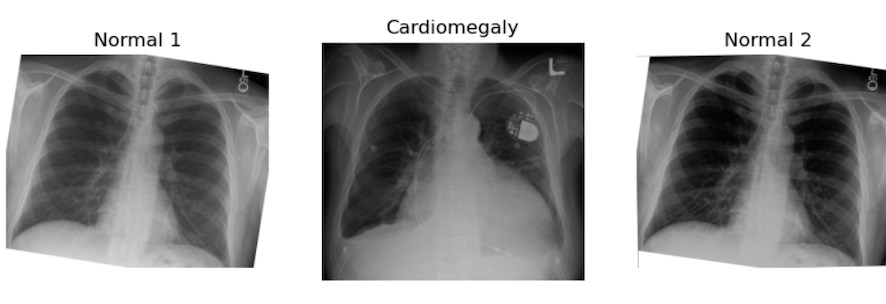
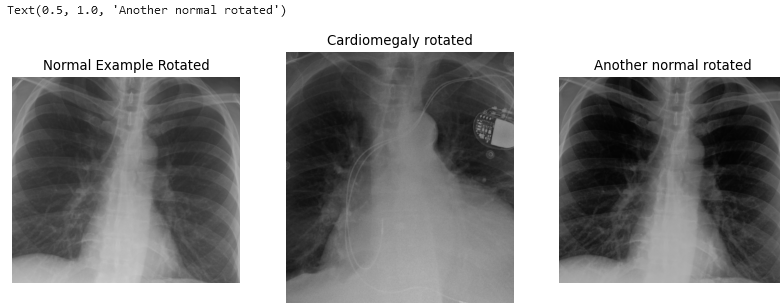
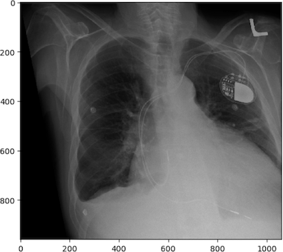
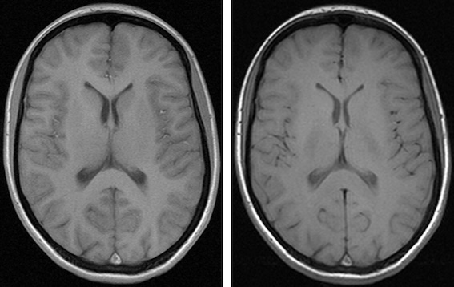

:::::::::::::::::::::::::::::::::::::: questions 

- What are the fundamental steps in preparing images for machine learning?
- What techniques can be used to augment data?
- How should data from various sources or collected under different conditions be handled?
- How can we generate features for machine learning using radiomics or volumetrics?

::::::::::::::::::::::::::::::::::::::::::::::::

::::::::::::::::::::::::::::::::::::: objectives

- Outline the fundamental steps involved in preparing images for machine learning
- Demonstrate data augmentation techniques using affine transformations
- Discuss the potential pitfalls of data augmentation
- Explain the concept of derived features, including radiomics and other pipeline-derived features
- Review image harmonization techniques at both the image and dataset levels

::::::::::::::::::::::::::::::::::::::::::::::::

## Basic steps

Datasets of images can serve as the raw data for machine learning (ML). While in rare cases they might be ready for use with minimal effort, in most projects, a significant portion of time is dedicated to cleaning and preparing the data. The quality of the data directly impacts the quality of the resulting models.

One of the initial steps in building a model involves manually inspecting both the data and metadata.

::::::::::::::::::::::::::::::::::::: challenge 

## Challenge: Thinking about metadata

What metadata should you examine in almost any radiological dataset?

Hint: Consider metadata pertinent to brain and thorax imaging.

:::::::::::::::::::::::: solution 

## Solution

In almost any radiological dataset, it is essential to examine the age and sex distribution. These metadata are crucial for both brain MRIs and chest X-rays, as well as for many other types of imaging studies.

:::::::::::::::::::::::::::::::::
:::::::::::::::::::::::::::::::::::::::::::::::::

In real-world scenarios, we often face the challenge of investigating a specific pathology that is relatively rare. Consequently, our dataset may contain thousands of normal subjects but relatively few with any pathology, and even fewer with the pathology of interest. This creates an imbalanced dataset and can introduce biases. For instance, if we aim to develop a model to detect heart failure on chest X-rays, but all our heart failure patients are older men, the model may incorrectly "focus" (by exploiting statistical correlations) on the absence of female breasts and signs of aging, rather than on true heart failure indicators like the cardiothoracic ratio.

Here are some initial steps to understanding your dataset if you plan to do supervised ML:

1. Check some images by hand: assess quality, content, and any unexpected elements.
2. Check some labeling by hand: ensure accuracy, consistency, and note any surprises.
3. Diversity check for obvious protected classes: examine images, labels, or metadata for representation.
4. Convert images to a lossless format and store a backup of the data collection.
5. Anonymize data: remove identifiable information within images (consider using OCR for text).
6. Determine important image features: consider creating cropped versions.
7. Normalize images: adjust for size, histogram, and other factors, ensuring proper centering when necessary.
8. Re-examine some images by hand: look for artifacts introduced during preprocessing steps.
9. Harmonize the dataset.
10. Create augmented and/or synthetic data.

When preparing images for unsupervised learning, many of these steps still apply. However, you must also consider the specific algorithm's requirements, as some segmentation algorithms may not benefit from additional data.

In our preparation for ML as outlined above, step two involves verifying the accuracy of labeling. The label represents the target variable you want your model to predict, so it is crucial to ensure that the labeling is both accurate and aligns with the outcomes you expect your model to predict.

In step three, we emphasize the importance of checking for diversity among protected classes—groups that are often subject to specific legislation in medical diagnostics due to historical underrepresentation. It is essential to ensure your dataset includes women and ethnic minority groups, as population-level variations can significantly impact model performance. For instance, chest circumference and height can vary greatly between populations, such as between Dutch and Indonesian people. While these differences might not affect an algorithm focused on cerebral blood flow, they are critical for others.

In step five, the focus is on anonymization, particularly in imaging data like ultrasounds, where patient names or diagnoses might appear directly on the image. Simple cropping may sometimes suffice, but more advanced techniques such as blurring, masking, or optical character recognition (OCR) should also be considered to ensure thorough anonymization.

We will cover step nine, dataset harmonization, in a separate section. For step ten, creating more data, synthetic data generation will be discussed further in an episode on generative AI. In the next section, we will explore examples of augmented data creation.

To work through our dataset augmentation examples, you will need an appropriate environment. You can build the environment using our `ml_environment` file (see the setup instructions).

Let's switch environments (assuming your environment is called `image_libraries`):

```bash
conda deactivate 
conda activate image_libraries
```

Then we need to get our sample images:

```bash
TBD
```

Let's go throught some examples. First, we import the libraries we need:

```python
import numpy as np
import matplotlib
from matplotlib import pyplot as plt
from skimage import data
from skimage import transform
from skimage import io
from skimage import img_as_float
from skimage.transform import rotate
from skimage import transform as tf
from skimage.transform import PiecewiseAffineTransform
```

Then, we import our example images and examine them.

```python
image_cxr1 = io.imread('rotatechest.png') # a relatively normal chest X-ray (CXR)
image_cxr_cmegaly = io.imread('cardiomegaly_cc0.png') # cardiomegaly CXR
image_cxr2 = io.imread('other_op.png') # a relatively normal CXR
# create figure
fig = plt.figure(figsize=(10, 7))
  
# setting values to rows and column variables
rows = 1
columns = 3

# Adds a subplot at the 1st position
fig.add_subplot(rows, columns, 1)
# showing image
plt.imshow(image_cxr1)
plt.axis('off')
plt.title("Normal 1")
  
# add a subplot at the 2nd position
fig.add_subplot(rows, columns, 2)
# showing image
plt.imshow(image_cxr_cmegaly)
plt.axis('off')
plt.title("Cardiomegaly")

# add a subplot at the 3nd position
fig.add_subplot(rows, columns, 3)
# showing image
plt.imshow(image_cxr2)
plt.axis('off')
plt.title("Normal 2")
```

{alt='CXR examples'}


::::::::::::::::::::::::::::::::::::: challenge 

## Challenge: Can you see some problems in the following scenario?

Imagine you got the above images and many more because you have been assigned to make an algorithm for cardiomegaly detection. The goal is to notify patients if their hospital-acquired X-rays, taken for any reason, show signs of cardiomegaly. This is an example of using ML for opportunistic screening.

You are provided with two datasets:

- A dataset of healthy (no cardiomegaly) patients from an outpatient clinic in a very poor area, staffed by first-year radiography students. These patients were being screened for tuberculosis (TB).
- A dataset of chest X-rays of cardiomegaly patients from an extremely prestigious tertiary inpatient hospital.

:::::::::::::::::::::::: solution 

## Solution
 
All of the following may pose potential problems:

- We may have different quality images from different machines for our healthy versus diseased patients, which could introduce a "batch effect" and create bias.
- At the prestigious hospital, many X-rays might be taken in the supine position. Will these combine well with standing AP X-rays?
- There could be concerns about the accuracy of labeling at the clinic since it was performed by lower-level staff.

:::::::::::::::::::::::::::::::::

::::::::::::::::::::::::::::::::::::::::::::::::


::::::::::::::::::::::::::::::::::::: challenge 

## Challenge: Prepare the images for classic supervised ML

Use `skimage.transform.rotate` to create two realistic augmented images from the given 'normal' image stored in the  variables.

Then, in a single block of code, apply what you perceive as the most critical preprocessing operations to prepare these images for classic supervised ML.

Hint: Carefully examine the shape of the cardiomegaly image. Consider the impact of harsh lines on ML performance.

:::::::::::::::::::::::: solution 

## Solution
 
```python
# figure out how much to cut on sides
print("cut top/bottom:", (image_cxr_cmegaly.shape[0] - image_cxr1.shape[0])/2)
cut_top_bottom = abs(round((image_cxr_cmegaly.shape[0] - image_cxr1.shape[0])/2))
# figure our how much to cut on top and bottom
print("cut sides:",(image_cxr_cmegaly.shape[1] - image_cxr1.shape[1])/2)

```

```output
cut top/bottom: -119.0
cut sides: -208.5
```


```python
cut_sides = abs(round((image_cxr_cmegaly.shape[1] - image_cxr1.shape[1])/2))
list_images = [image_cxr1, image_cxr_cmegaly, image_cxr2]
better_for_ml_list = []
for image in list_images:
    image = rotate(image,2)
    image = image[cut_top_bottom:-cut_top_bottom, cut_sides: -cut_sides]
    better_for_ml_list.append(image)

# create figure for display
fig = plt.figure(figsize=(10, 7))
  
# setting values to rows and column variables
rows = 1
columns = 3

# add a subplot at the 1st position
fig.add_subplot(rows, columns, 1)
# showing image
plt.imshow(better_for_ml_list[0])
plt.axis('off')
plt.title("Normal 1")
  
# add a subplot at the 2nd position
fig.add_subplot(rows, columns, 2)
# showing image
plt.imshow(better_for_ml_list[1])
plt.axis('off')
plt.title("Augment 1")

# add a subplot at the 3nd position
fig.add_subplot(rows, columns, 3)
# showing image
plt.imshow(better_for_ml_list[2])
plt.axis('off')
plt.title("Augment 2")


```
{alt='augmented chest x-ray different sizes'}

```python
# find a size we want to resize to, here the smallest
zero_side = []
one_side = []
for image in better_for_ml_list:
    zero_side.append(image.shape[0])
    zero_side.sort()
    one_side.append(image.shape[1])
    one_side.sort()
smallest_size = zero_side[0], one_side[0]
# make resized images
resized = []
for image in better_for_ml_list:
    image =  resize(image, (smallest_size))
    resized.append(image)

# create figure for display
fig = plt.figure(figsize=(10, 7))
  
# setting values to rows and column variables
rows = 1
columns = 3

# add a subplot at the 1st position
fig.add_subplot(rows, columns, 1)
# showing image
plt.imshow(resized[0])
plt.axis('off')
plt.title("Normal 1")
  
# add a subplot at the 2nd position
fig.add_subplot(rows, columns, 2)
# showing image
plt.imshow(resized[1])
plt.axis('off')
plt.title("Augment 1")

# add a subplot at the 3nd position
fig.add_subplot(rows, columns, 3)
# showing image
plt.imshow(resized[2])
plt.axis('off')
plt.title("Augment 2")
```


{alt='augmented chest x-ray'}


There are a few key considerations to keep in mind regarding the choices made here. The goal is to create data that realistically represents what might occur in real-life scenarios. For example, a 2-degree rotation is far more realistic than a 25-degree rotation. Unless you are using a rotationally invariant algorithm or another advanced method that accounts for such differences, even small rotations can make every pixel slightly different for the computer. A 2-degree rotation closely mirrors what might happen in a clinical setting, making it a more practical choice.

Additionally, the results can be further improved by cropping the images. Generally, we aim to minimize harsh, artificial lines in any images used for ML algorithms, unless those lines are consistent across all images. It is a common observation among practitioners that many ML algorithms tend to "focus" on these harsh lines, so if they are not uniformly present, it is better to remove them. As for how much to crop, we based our decision on the size of our images. While you don't need to follow our exact approach, it is important to ensure that all images are ultimately the same size and that all critical features are retained.

:::::::::::::::::::::::::::::::::

::::::::::::::::::::::::::::::::::::::::::::::::

Of course, there are numerous other transformations we can apply to images beyond rotation. For example, let's explore applying a shear:


```python
# create affine transform
affine_tf = tf.AffineTransform(shear=0.2)

# apply transform to image data
image_affine_tf = tf.warp(image_cxr_cmegaly, inverse_map=affine_tf)

# display the result
io.imshow(image_affine_tf)
io.show()
```
{alt='augmented by shear chest x-ray'}

And finally, let's demonstrate a "wave over a mesh." We'll start by creating a grid, or "mesh," over our image, represented by dots in our plot. Then, we'll apply a warp function to transform the image into the shape of a wave.

```python
rows, cols = image_affine_tf.shape[0], image_affine_tf.shape[1]

# np.linspace will return evenly spaced numbers over an interval
src_cols = np.linspace(0, cols, 20)
# ie above is start=0, stop = cols, num = 50, and num is the number of chops
src_rows = np.linspace(0, rows, 10)

# np.meshgrid returns coordinate matrices from coordinate vectors.
src_rows, src_cols = np.meshgrid(src_rows, src_cols)

# numpy dstack stacks along a third dimension in the concatenation
src = np.dstack([src_cols.flat, src_rows.flat])[0]
dst_rows = src[:, 1] - np.sin(np.linspace(0, 3 * np.pi, src.shape[0])) * 50
dst_cols = src[:, 0]
dst_rows *= 1.5
dst_rows -= 1.5 * 50
dst = np.vstack([dst_cols, dst_rows]).T

tform = PiecewiseAffineTransform()
tform.estimate(src, dst)
noform = PiecewiseAffineTransform()
noform.estimate(src, src)

out_rows = image_affine_tf.shape[0] - 1.5 * 50
out_cols = cols
out = tf.warp(image_affine_tf, tform, output_shape=(out_rows, out_cols))
# create figure
fig = plt.figure(figsize=(10, 7))
  
# setting values to rows and column variables
rows = 1
columns = 4

# add a subplot at the 1st position
fig.add_subplot(rows, columns, 1)
# showing image
plt.imshow(image_affine_tf)
plt.axis('off')
plt.title("Normal")
  
# add a subplot at the 2nd position
fig.add_subplot(rows, columns, 2)
# showing image
plt.imshow(image_affine_tf)
plt.plot(noform.inverse(src)[:, 0], noform.inverse(src)[:, 1], '.b')
plt.axis('off')
plt.title("Normal and Mesh")

# add a subplot at the 3nd position
fig.add_subplot(rows, columns, 3)
# showing image
plt.imshow(out)

plt.axis('off')
plt.title("Augment")

# add a subplot at the 3nd position
fig.add_subplot(rows, columns, 4)
# showing image
plt.imshow(out)
plt.plot(tform.inverse(src)[:, 0], tform.inverse(src)[:, 1], '.b')
plt.axis('off')
plt.title("Augment and Mesh")
```

{alt='augmented by waves chest x-ray'}

The last transformation doesn’t appear realistic. The chest became noticeably widened, which could be problematic. When augmenting data, there are numerous possibilities, but it's crucial to ensure the augmented data remains realistic. Only a subject matter expert (typically a pathologist, nuclear medicine specialist, or radiologist) can accurately determine what realistic data should look like.

## Images' features

So far, we've focused on examples where we directly manipulate images. However, much of ML involves working with derived values from images, often converted into tabular data. In fact, it's possible to combine images with various types of tabular data in multiple ways for ML. But before exploring these methods, let's first consider using image features alone as inputs for ML.

Two notable examples of image features are volumetric data and radiomic data. Handling such data at scale—when dealing with thousands of images—typically involves automated processes rather than manual measurements. In the past, pioneers like Benjamin Felson, a founding figure in modern chest X-ray analysis, painstakingly analyzed hundreds of X-rays by hand to gather statistics. Today, processing pipelines allow us to efficiently analyze thousands of images simultaneously.

We aim to integrate images into a pipeline that automatically generates various types of data. A notable example of such a feature pipeline, particularly for brain imaging, is [Freesurfer](https://surfer.nmr.mgh.harvard.edu/). Freesurfer facilitates the extraction of volume and other relevant data from brain imaging scans.

::::::::::::::::::::::::::::::::::::: challenge  

## Challenge: Identifying issues with pipeline outputs in the absence of original images

Consider potential issues that could arise from using the output of a pipeline without accessing the original images.

:::::::::::::::::::::::: solution  

## Solution

One major concern is accuracy, as pipelines may mislabel or miscount features, potentially leading to unreliable data analysis or model training. To mitigate these issues, consider:

- Manual verification: validate pipeline outputs by manually reviewing a subset of images to ensure consistency with expected results.
- Literature review: consult existing research to establish benchmarks for feature counts and volumes, helping identify discrepancies that may indicate pipeline errors.
- Expert consultation: seek insights from radiologists or domain experts to assess the credibility of pipeline outputs based on their clinical experience.

Proceed with caution when relying on pipeline outputs, especially without direct access to the original images.

Another challenge with pipelines is that the results can vary significantly depending on which one is chosen. For a detailed exploration of how this can impact fMRI data, see this [Nature article](https://doi.org/10.1038/s41467-024-48781-5). Without access to the original images, it becomes difficult to determine which pipeline most accurately captures the desired outcomes from the data.

:::::::::::::::::::::::::::::::::

::::::::::::::::::::::::::::::::::::::::::::::::::::::::::::::::::

Morphometric or volumetric data represents one type of derived data, but radiomics introduces another dimension. Radiomics involves analyzing mathematical characteristics within images, such as entropy or kurtosis. Similar methodologies applied to pathology are referred to as pathomics. Some define radiomics and pathomics as advanced texture analysis in medical imaging, while others argue they encompass a broader range of quantitative data than traditional texture analysis methods.

Regardless of the data type chosen, the typical approach involves segmenting and/or masking an image to isolate the area of interest, followed by applying algorithms to derive radiomic or pathomic features. While it's possible to develop custom code for this purpose, using established packages is preferred for ensuring reproducibility. For future reproducibility, adherence to standards such as those set by the International Bio-imaging Standards Initiative ([IBSI](https://theibsi.github.io/)) is crucial.

Below is a list of open-source* libraries that facilitate this type of analysis:


|        | `mirp`    | `pyradiomics`        | `LIFEx`           |`radiomics`           |
|--------|-----------|-----------------------|-----------------|-----------------| 
| License     | EUPL-1.2              | BSD-3             | custom           | GPL-3.0      |
| Last updated    | 5/2024      | 1/2024           | 6/2023         | 11/2019          |
| Programming language | Python        | Python                         | Java            | MATLAB           |
| IBSI-1 compliant     | yes              | partial              | yes             | no claim             |
| IBSI-2 compliant     | yes        | no claim           | yes           | no claim        |
| Interface            | high-level API       | high-level API, Docker| GUI, low-level API    | low-level API      |
| Website     | [GitHub](https://github.com/oncoray/mirp) | [GitHub](https://github.com/AIM-Harvard/pyradiomics)  | [website](https://www.lifexsoft.org/) | [GitHub](https://github.com/mvallieres/radiomics)    | 
| Early publication |[JOSS publication](https://joss.theoj.org/papers/10.21105/joss.06413)| [doi:10.1158/0008-5472.CAN-17-0339](https://doi.org/10.1158/0008-5472.CAN-17-0339)  |[doi:10.1158/0008-5472.CAN-18-0125](https://doi.org/10.1038/s41598-022-16609-1)|[doi:10.1088/0031-9155/60/14/5471](https://doi.org/10.1088/0031-9155/60/14/5471)| 
| Notes |    relative newcomer    | very standard and supported| user-friendly   | * MATLAB requires a license |

Once we have tabular data, we can apply various algorithms to analyze it. However, applying ML isn't just a matter of running algorithms and getting quick results. In the next section, we will explore one reason why this process is more complex than it may seem.

## Harmonization

We often need to harmonize either images or datasets of derived features. When dealing with images, differences between datasets can be visually apparent. For example, if one set of X-rays consistently appears darker, it may be wise to compare average pixel values between datasets and adjust normalization to achieve more uniformity. This is a straightforward scenario.

Consider another example involving derived datasets from brain MRIs with Virchow Robin’s spaces. One dataset was captured using a 1.5 Tesla machine in a distant location, while the other used an experimental 5 Tesla machine (high resolution) in an advanced hospital. These machines vary in resolution, meaning what appears as a single Virchow Robin’s space at low resolution might actually show as two or three smaller spaces fused together at high resolution. This is just one potential difference.

Below are images of the same patient scanned with 1.5 Tesla and 3 Tesla machines:

{alt='T1 v T3'}

*Sourced from [Bernd L. Schmitz, Andrik J. Aschoff, Martin H.K. Hoffmann and Georg Grön, Advantages and Pitfalls in 3T MR Brain Imaging: A Pictorial Review, American Journal of Neuroradiology October 2005, 26 (9) 2229-2237](https://www.ajnr.org/content/26/9/2229)*

Different contrast levels significantly affect the visibility of structures like the caudate and thalami in brain images. As a result, the radiomic characteristics of these images, including contrast and possibly other parameters, can vary even when they originate from the same patient.

Constructing a dataset based solely on extensive, unharmonized derived data is not always practical. However, without access to the original images, it becomes difficult to fully understand and account for these variations.

We recommend the following approach:

1. Compare the data using descriptive statistics and your knowledge of the patient groups. Consider whether you expect similar counts across both groups, and justify your reasoning.
2. Explore the use of a harmonization package to standardize data across different datasets.

Below are three examples from the field of neuroimaging:

|             | `neurocombat`    | `haca3`        | `autocombat`           |
|-------------|------------------|----------------|------------------------|
| License     | MIT for Python/ Artistic for R  | Missing?   | Apache 2.0  |
| Last updated| 2021             | 2024           |2022        | 
| Programming language | Python or R     | Python      | Python         | 
| Organ/area and modality | brain MRI     | brain MRI              | brain MRI  |
| Data type |  derived values    | images        | derived values       | 
| Notes     | no standard release yet  | versioned but not released   | not release, not versioned |
| Original website     | [GitHub](https://github.com/Jfortin1/ComBatHarmonization) | [GitHub](https://github.com/lianruizuo/haca3) | [GitHub](https://github.com/Alxaline/ComScan)    | 
| Early publication |[doi: 10.1016/j.neuroimage.2017.08.047](https://doi.org/10.1016/j.neuroimage.2017.08.047)| [doi:10.1016/j.compmedimag.2023.102285](https://doi.org/10.1016/j.compmedimag.2023.102285)  |[doi: 10.1038/s41598-022-16609-1 ](https://doi.org/10.1038/s41598-022-16609-1)|
| Versioned website |  [versioned on cvasl](https://github.com/brainspinner/cvasl/tree/main/cvasl/vendor/neurocombat) | [versioned on GitHub](https://github.com/lianruizuo/haca3)| [versioned on cvasl](https://github.com/brainspinner/cvasl/tree/main/cvasl/vendor/comscan)  

There are numerous packages available for brain MRI alone, not to mention those for imaging the rest of the body. We have selected these three examples to highlight some of the common issues and pitfalls associated with such packages.

::::::::::::::::::::::::::::::::::::: challenge  

## Challenge: Identifying potential problems in each package

Consider issues that might hinder your implementation with each package.

:::::::::::::::::::::::: solution  

## Solution

Aging code: `neurocombat` was last modified three years ago. It may rely on outdated dependencies that could pose compatibility issues with newer hardware and software environments. Additionally, the lack of versioned releases makes it challenging to track changes and updates.

No license: `haca3` does not have a clear license available. Using code without a proper license could lead to legal complications and uncertainties about its usage rights.

No releases and versioning: `autocombat` lacks both released versions and versioning practices. Without clear versioning, it becomes difficult to ensure consistency and compare results across different implementations of the package.
 
:::::::::::::::::::::::::::::::::

::::::::::::::::::::::::::::::::::::::::::::::::::::::::::::::::::

We've pointed out a few potential issues to highlight common challenges with such programs. Looking ahead, consider developing a harmonization package that's sustainable and useful for your research community.

While each of these packages has its strengths for researchers, none are perfect. Choose wisely when selecting a package! Also, remember you can create your own harmonization method through coding or develop it into a package for others to use.

:::::::::::::::::::::::::::::::::::::::: keypoints

- Direct knowledge of specific data cannot be substituted
- Statistical analysis is essential to detect and mitigate biases in patient distribution
- Verify if derived data aligns with known clinical realities through statistical examination
- Evaluate the validity and utility of data augmentation methods before applying them
- Radiomics enables the use of mathematical image qualities as features
- There are several accessible pipelines for volumetrics and radiomics
- Data from different machines (or even the same machines with different settings) often requires harmonization, achievable through coding and the use of existing libraries

::::::::::::::::::::::::::::::::::::::::::::::::::
