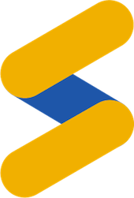

:::::::::::::::::::::::::::::::::::::: questions 

TBD

::::::::::::::::::::::::::::::::::::::::::::::::

::::::::::::::::::::::::::::::::::::: objectives

TBD

::::::::::::::::::::::::::::::::::::::::::::::::

## Introduction

In the realm of medical imaging analysis, registration and segmentation play crucial roles. Registration aligns images, enabling the fusion of data or the tracking of changes over time. Segmentation identifies and labels objects of interest within images. Automation is essential due to high clinical demand, driving the development of robust algorithms for both processes. Moreover, many advanced segmentation techniques utilize image registration, whether implicitly or explicitly.

[SimpleITK](https://github.com/SimpleITK/SimpleITK) (SITK) is a simplified programming interface to the algorithms and data structures of the [Insight Toolkit](https://itk.org/) (ITK) for segmentation, registration and advanced image analysis, available in many programming languages (e.g., C++, Python, R, Java, C#, Lua, Ruby).

{alt='SITK logo.'}

SimpleITK is part of the [Insight Software Consortium](https://insightsoftwareconsortium.org/) a non-profit educational consortium dedicated to promoting and maintaining open-source, freely available software for medical image analysis. Its copyright is held by [NumFOCUS](https://numfocus.org/), and the software is distributed under the [Apache License 2.0](https://github.com/SimpleITK/SimpleITK/blob/master/LICENSE).

In this episode, we use a hands-on approach utilizing Python to show how to use SimpleITK for performing registration and segmentation tasks in medical imaging use cases.

## Foundations

TBD

## Big Data

TBD

## Registration

TBD

## Segmentation

TBD

## Results Visualization

TBD

## Acknowledgements

This episode was largely inspired by [the official SITK tutorial](https://simpleitk.org/TUTORIAL/#tutorial), which is copyrighted by NumFOCUS and distributed under the [Creative Commons Attribution 4.0 International License](https://creativecommons.org/licenses/by/4.0/).

::::::::::::::::::::::::::::::::::::: callout

Callout section.

::::::::::::::::::::::::::::::::::::::::::::::::

:::::::::::::::::::::::::::::::::::::::::::::::::::::::::::::::::::: instructor

For the "Instructor View".

::::::::::::::::::::::::::::::::::::::::::::::::::::::::::::::::::::::::::::::::

::::::::::::::::::::::::::::::::::::: challenge 

## Exercise example

Exercise description.

:::::::::::::::::::::::: solution 
 
Solution.

:::::::::::::::::::::::::::::::::

::::::::::::::::::::::::::::::::::::::::::::::::
